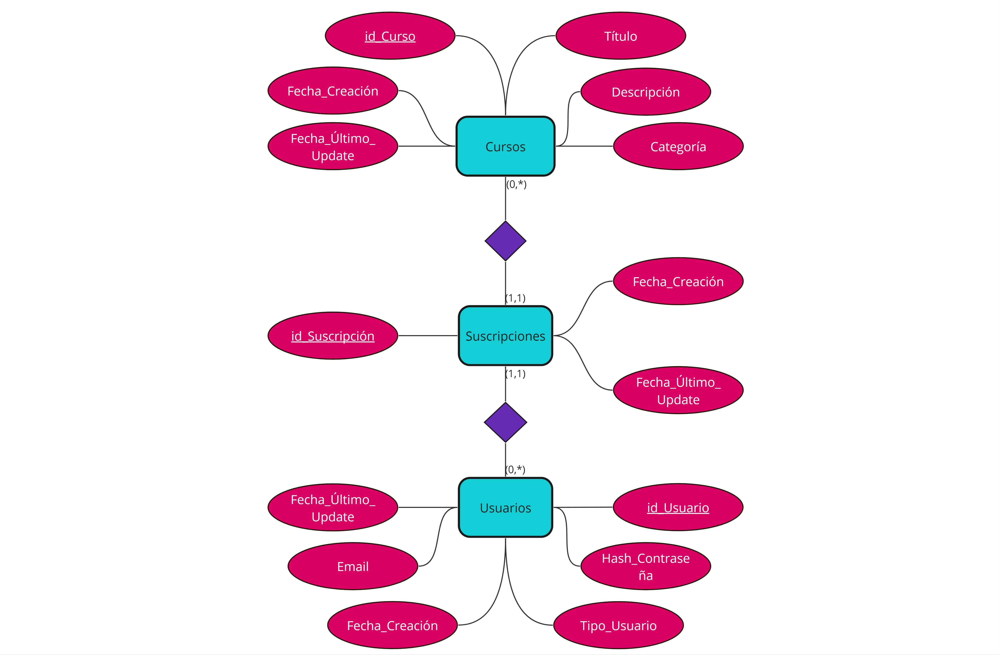

# Arquitectura-de-Software-UCC
**Se solicita la creación de un sistema de gestión de cursos en línea (LMS), donde se destacan dos componentes a ser desarrollados.**

* El backend, desarrollado en Golang, brindará todas las interfaces necesarias para dar solución al requerimiento.
* El frontend, desarrollado en React, representa la vista final del usuario y consumirá los servicios desarrollados en el backend.

## Backend:
* **Autenticación de usuarios:** Implementar un sistema de login y gestión de permisos de usuarios. Deben existir 2 tipos de usuarios: *alumno* y *administrador*.
* **Gestión de cursos:** Desarrollar endpoints que permitan la creación, edición, y eliminación de cursos por parte de los administradores.
* **Gestión de usuarios inscritos:** Implementar un endpoint para listar los cursos a los que un usuario está inscrito.
* **Seguridad:** Garantizar la seguridad de las transacciones (autorización por token
firmado entre frontend y backend) y datos (hashing de contraseñas) del sistema.

## Frontend:

* **Pantalla de inicio (Home):** Mostrar un listado de cursos disponibles para inscripción.
* **Búsqueda de cursos:** Implementar un motor de búsqueda que permita a los usuarios encontrar cursos por palabras clave o categorías.
* **Detalle del curso:** Mostrar información detallada sobre un curso seleccionado, incluyendo descripción, instructor, duración, y requisitos.
* **Inscripción en curso:** Habilitar un botón de inscripción para que los usuarios puedan registrarse en los cursos de su interés.
* **Mis cursos:** Mostrar un listado de los cursos a los que el usuario está inscrito, con la opción de acceder a los detalles de cada curso.

## CONDICIONES:

### Parcial (Regularidad):
***Para regularizar la materia se pide el desarrollo relacionado con la autenticación de usuarios, la visualización de la página de inicio con el listado de cursos, la búsqueda de cursos y la funcionalidad de inscripción.***

### Final (Aprobado):
***Para el examen final se solicita el desarrollo completo del sistema y puntos extras enumerados a continuación:***

* Gestión de cursos por parte de los administradores.
* Seguridad del sistema en todos los componentes.
* Funcionalidad de listado de cursos a los que está inscrito el usuario.
* Implementar un sistema de comentarios y valoraciones para los cursos.
* Permitir a los usuarios subir archivos relacionados con los cursos.
* Dockerizar y componer la solución completa.

## Criterios de Evaluación:
### Parcial:
* **General:**
    * El código fuente del proyecto está subido a Github.
* **Frontend:**
    * Se muestra correctamente el formulario de login para usuario alumno y administrador.
    * Se muestra correctamente la home con listado/búsqueda de cursos para seleccionar.
    * Se muestra correctamente el detalle del curso seleccionado.
    * Se muestra correctamente la página o mensaje de congrats al inscribirse a un curso.
* **Backend:**
    * Implementa login recibiendo las credenciales y genera el token de acceso JWT.
    * Implementa correctamente la búsqueda de cursos.
    * Respeta estructura MVC y responsabilidades de modelo, vista y controlador y DTO.
    * No ignora errores y retorna correctamente los códigos de estado.
* **Base de Datos:**
    * La base de datos no almacena la información de la password de forma plana.
    * Se conecta correctamente contra la base de datos usando GORM.
    * Las distintas tablas en la base no duplican la información en más de una tabla.

### Final:
* **General:**
    * Se mantienen los criterios del Parcial.
    * La aplicación completa se puede correr utilizando Docker.
* **Frontend:**
    * Se muestra correctamente la página de mis cursos para el usuario alumno.
    * Se muestra correctamente el formulario/resultado de agregar un comentario.
    * Permite al usuario subir archivos relacionados a los cursos.
    * Se muestra correctamente la carga de un curso para el usuario administrador.
* **Backend:**
    * Implementa correctamente la creación de la curso.
    * Implementa correctamente el listado de cursos para un usuario.
    * Implementa correctamente el agregado y listado de comentarios.
    * Permite al usuario subir archivos relacionados a los cursos.

## Repositorios Útiles:
1. Repositorio del Edu [Sensores](https://github.com/ucc-arq/mvc-go)
2. Repositorio del Emi [Actividades en clase](https://github.com/eric-1918/ucc-as-edd)
3. General: [Consigna del trabajo](https://drive.google.com/drive/folders/1E8c5Nrn12-fuPaUWXXetELYa25e1c2g6)

## Base de Datos:
### Diagrama Entidad Relación:

### Diagrama de clases:

Frontend: Resumen
Pantalla de inicio (Home): Se muestran los cursos disponibles usando CourseList.
Búsqueda de cursos: Implementado en CourseSearch y utilizado en Home.
Detalle del curso: Mostrado en CourseDetail y accesible desde CoursePage.
Inscripción en curso: Realizado a través del EnrollButton.
Mis cursos: Listado y detallado en MyCourses y accesible desde MyCoursesPage.
